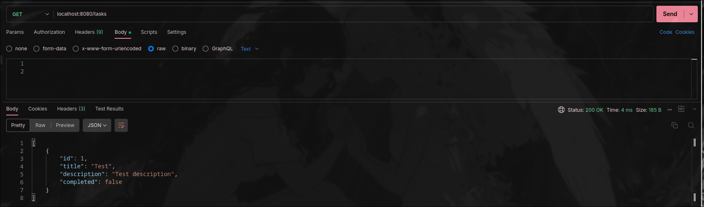
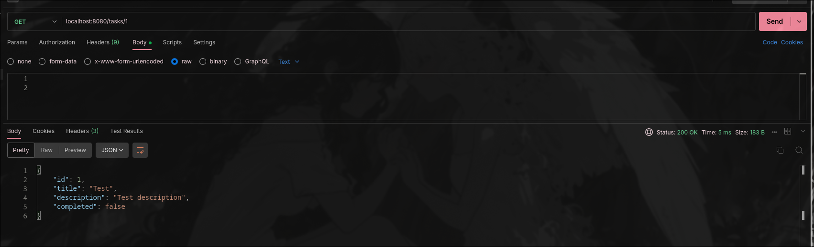
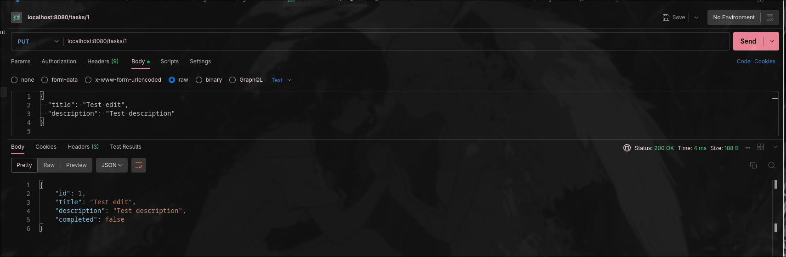
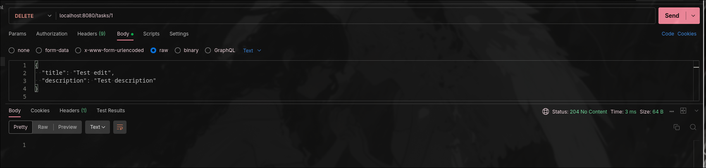

КТ 1

Запуск:
```sh
docker compose up --build
```
Сервер будет работать на порте 8080

1. Создание задачи
```sh
POST /tasks
```
Тело (JSON):
```sh
title (string, обязательно)
description (string, опционно)
completed (boolean, опционно, по умолчанию false)
```
201: Created + объект задачи (включая id)


2. Получение списка задач
```sh
GET /tasks
```
Параметры:
```sh
completed (boolean, опционно) 
```
200:OK + массив задач


3. Получение задачи
```sh
GET /tasks/{id}
```
200:OK + объект задачи или 404 Not Found если не найдено


4. Обновление задачи
```sh
PUT /tasks/{id}
```
Тело (JSON): 
```sh
title, description, completed (все опционально)
```
200:OK + обновлённый объект задачи


5. Удаление задачи
```sh
DELETE /tasks/{id}
```
204:No Content / 404 Not Found 
